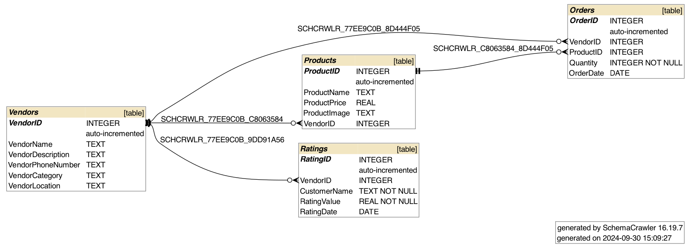

# Natural Language SQL Project

### Purpose of the Database

My database models vendor and product data for a marketplace application, which includes vendors, their products, customer ratings, and orders.

### Schema



---

## Query I thought it did well on

**Question**: Which vendors have the highest rating?

**GPT SQL Response**:
```sql
SELECT Vendors.VendorID, Vendors.VendorName, MAX(Ratings.RatingValue) as MaxRating
FROM Vendors 
INNER JOIN Ratings ON Vendors.VendorID = Ratings.VendorID
GROUP BY Vendors.VendorID, Vendors.VendorName
ORDER BY MaxRating DESC;
```

**Friendly Response**: The vendors with the highest rating are Panadería El Salvador, El Rincón del Café, and Pura Vida Tienda, all with a perfect score of 5.0. Following them are Mercado Flores and McDonald's, both with a rating of 4.0.

## Question that it tripped up on

**Question**: Which vendors sell products priced over $20?

**GPT SQL Response**:
```sql
SELECT Vendors.VendorName FROM Vendors JOIN Products ON Vendors.VendorID = Products.VendorID WHERE Products.ProductPrice > 20;
```

SQL Result: []

**Friendly Response**: Unfortunately, there are currently no vendors selling products priced over $20.

While the SQL was correct, the response was empty because no data matched the query. GPT correctly identified the issue but gave a generic response.

## Multi-shot

**Question**: What products are sold in Antigua Guatemala?

**GPT SQL Response**:
```sql
SELECT ProductName FROM Products WHERE VendorID IN (SELECT VendorID FROM Vendors WHERE VendorLocation = 'Antigua Guatemala');
```

SQL Result: [('Espresso',), ('Café Latte',)]

**Friendly Response**: In Antigua Guatemala, you can find products such as Espresso and Café Latte.

## Conclusion

My findings show that for queries with well-structured joins, GPT-4 does well in generating SQL queries and interpreting the results. However, for cases where no data is returned, GPT tends to give generic responses. This could be improved with better prompting strategies.
